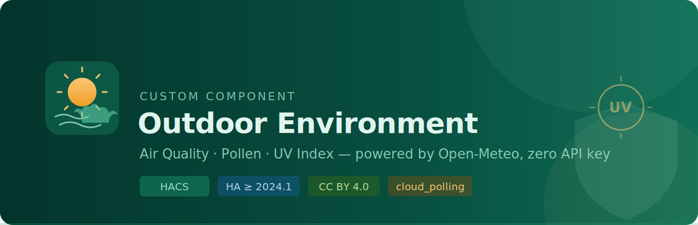
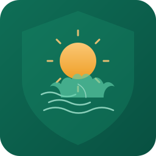

# Outdoor Environment

<p align="center">
  
</p>

<p align="center">
  <a href="https://github.com/hacs/integration"></a>
  <a href="https://www.home-assistant.io/blog/categories/release-notes/"></a>
  <a href="https://creativecommons.org/licenses/by/4.0/"></a>
  <a href="#"></a>
  <a href="https://github.com/nuggetz/ha-outdoor-environment/actions/workflows/validate.yml"></a>
  <a href="LICENSE"></a>
</p>

A Home Assistant custom integration that exposes **80+ outdoor environment sensors** using two free, no-key [Open-Meteo](https://open-meteo.com) APIs.

> **Zero API key · Zero registration · Zero cost · Global coverage**

---

## Sensor groups

| Group | Sensors | Default |
|-------|---------|:-------:|
| **A — Air Quality** | AQI EU + US, PM2.5, PM10, NO₂, O₃, SO₂, CO, CO₂, dust, AOD, NH₃, CH₄ | ✅ |
| **A-sub — EU sub-AQI** | EU sub-AQI per pollutant (PM2.5, PM10, NO₂, O₃, SO₂) | ⬜ |
| **A-sub-us — US sub-AQI** | US sub-AQI per pollutant (PM2.5, PM10, NO₂, CO, O₃, SO₂) | ⬜ |
| **A-extra — Advanced** | Formaldehyde, glyoxal, NO, PAN, sea salt aerosol | ⬜ |
| **B — Pollen** | Grass, birch, alder, olive, ragweed, mugwort | ⬜ |
| **C — UV** | UV Index, UV Index Clear Sky | ✅ |
| **D — Weather** | Temperature, humidity, apparent temp, dew point, precipitation, wind, cloud cover, visibility, pressure, weather code | ✅ |
| **D-agro — Agro** | Evapotranspiration (ET0), VPD, CAPE, wet bulb temperature | ⬜ |
| **E — Solar** | GHI, direct, diffuse, DNI, terrestrial radiation, GTI (optional) | ✅ |
| **F — Derived** | Comfort index, heat index, wind chill, dominant pollutant, pollen risk, ventilation score, solar production factor, irrigation needed, frost risk, lightning risk | ✅/⬜ |

---

## Installation

### Via HACS (recommended)

1. Open HACS → Integrations → ⋮ → **Custom repositories**
2. Add `https://github.com/nuggetz/ha-outdoor-environment` → category **Integration**
3. Install **Outdoor Environment** and restart Home Assistant

### Manual

Copy `custom_components/outdoor_environment/` to your HA `custom_components/` directory and restart.

---

## Configuration

Go to **Settings → Devices & Services → Add Integration → Outdoor Environment**.

**Step 1 (required):** Choose location and which sensor groups to enable.

**Step 2 (optional):** Set solar panel tilt and azimuth to unlock the GTI sensor (great for PV owners).

All settings are adjustable later via **Configure** (options flow), including update intervals, irrigation threshold, and advanced sensor groups.

---

## Automation examples

### Close blinds when grass pollen is high

```yaml
automation:
  trigger:
    - platform: numeric_state
      entity_id: sensor.outdoor_pollen_grass
      above: 30
  action:
    - service: cover.close_cover
      target:
        entity_id: cover.living_room_blinds
```

### Open windows when air quality and wind are good

```yaml
automation:
  trigger:
    - platform: numeric_state
      entity_id: sensor.outdoor_ventilation_score
      above: 60
  condition:
    - condition: template
      value_template: >
        {{ state_attr('sensor.outdoor_ventilation_score', 'recommendation') == 'ventilate' }}
  action:
    - service: fan.turn_on
      target:
        entity_id: fan.hrv_unit
```

### Trigger irrigation when ET0 deficit exceeds threshold

```yaml
automation:
  trigger:
    - platform: state
      entity_id: sensor.outdoor_irrigation_needed
      to: "True"
  action:
    - service: switch.turn_on
      target:
        entity_id: switch.garden_irrigation
```

### Notify when UV protection is needed

```yaml
automation:
  trigger:
    - platform: template
      value_template: >
        {{ state_attr('sensor.outdoor_uv_index', 'protection_required') == true }}
  action:
    - service: notify.mobile_app
      data:
        message: "UV index {{ states('sensor.outdoor_uv_index') }} — apply sunscreen!"
```

---

## Data sources

| API | Endpoint | Update interval |
|-----|----------|-----------------|
| Open-Meteo Air Quality | `air-quality-api.open-meteo.com` | 60 min (configurable 30–360) |
| Open-Meteo Forecast | `api.open-meteo.com` | 15 min (configurable 10–60) |

Data licensed under [CC BY 4.0](https://creativecommons.org/licenses/by/4.0/) — attribution: *Data provided by Open-Meteo*.

---

## Development

```bash
python -m venv .venv && source .venv/bin/activate
pip install -r requirements_test.txt
pytest --cov=custom_components/outdoor_environment
```

---

<p align="center">
  
  <br>
  <sub>Made with ☀️ for the Home Assistant community</sub>
</p>
