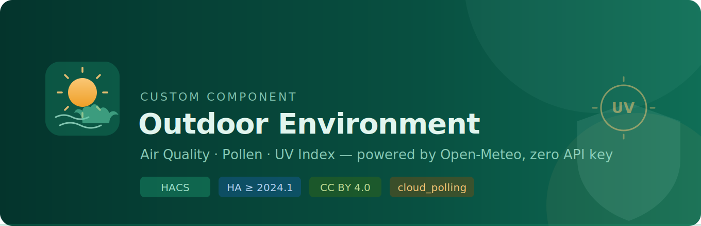

# Outdoor Environment

<p align="center">
  
</p>

<p align="center">
  <a href="https://github.com/hacs/default"></a>
  <a href="https://www.home-assistant.io/blog/categories/release-notes/"></a>
  <a href="https://creativecommons.org/licenses/by/4.0/"></a>
  <a href="#"></a>
  <a href="https://github.com/nuggetz/ha-outdoor-environment/actions/workflows/validate.yml"></a>
  <a href="LICENSE"></a>
</p>

A Home Assistant custom integration that exposes **80+ outdoor environment sensors** using two free, no-key [Open-Meteo](https://open-meteo.com) APIs.

> **Zero API key · Zero registration · Zero cost · Global coverage**

<p align="center">
  <a href="https://my.home-assistant.io/redirect/hacs_repository/?owner=nuggetz&repository=ha-outdoor-environment&category=integration"></a>
  <a href="https://my.home-assistant.io/redirect/config_flow_start/?domain=outdoor_environment"></a>
</p>

---

## Sensor groups

| Group | Sensors | Default |
|-------|---------|:-------:|
| **A — Air Quality** | AQI EU + US, PM2.5, PM10, NO₂, O₃, SO₂, CO, CO₂, dust, AOD, NH₃, CH₄ | ✅ |
| **A-sub — EU sub-AQI** | EU sub-AQI per pollutant (PM2.5, PM10, NO₂, O₃, SO₂) | ⬜ |
| **A-sub-us — US sub-AQI** | US sub-AQI per pollutant (PM2.5, PM10, NO₂, CO, O₃, SO₂) | ⬜ |
| **A-extra — Advanced** | Formaldehyde, glyoxal, NO, PAN, sea salt aerosol | ⬜ |
| **B — Pollen** | Grass, birch, alder, olive, ragweed, mugwort | 🌍 |
| **C — UV** | UV Index, UV Index Clear Sky | ✅ |
| **D — Weather** | Temperature, humidity, apparent temp, dew point, precipitation, wind, cloud cover, visibility, pressure, weather code | ✅ |
| **D-agro — Agro** | Evapotranspiration (ET0), VPD, CAPE, wet bulb temperature | ⬜ |
| **E — Solar** | GHI, direct, diffuse, DNI, terrestrial radiation, GTI (optional) | ✅ |
| **F — Derived** | Comfort index, heat index, wind chill, dominant pollutant, pollen risk, ventilation score, solar production factor, lightning risk | ⚙️ |
| **F — Binary** | Irrigation needed, frost risk — on the `binary_sensor` platform | ⬜ |
| **G — AQ forecast** | EU and US AQI daily maximum, today and tomorrow | ⬜ |

✅ enabled by default · ⬜ available, disabled by default · 🌍 enabled by default only for
locations inside Europe, where Open-Meteo publishes pollen data · ⚙️ derived from the groups
above: each sensor exists when the group it reads from is enabled, and a few are disabled by
default because they are niche.

Everything is available regardless — a disabled group is one switch away in **Configure**.

### Reading `Comfort Index`

A single 0-100 score built on apparent temperature, where **100 is comfortable and 0 is
dangerous**. It sits at 100 between 18 °C and 24 °C apparent, and falls to 0 at 40 °C on the
hot side and at −10 °C on the cold side. The curve is continuous, so the score never jumps,
and it is defined at every temperature rather than only inside a band.

`Heat Index` and `Wind Chill` remain separate entities in °C and are reported only in the
conditions their formulas are valid for, so they are `unknown` the rest of the time.

### Reading the air quality forecast

Four opt-in sensors: the **daily maximum** European and US AQI for today and tomorrow. Enable
them under **Configure**.

The maximum covers the **whole calendar day**, including hours that have already passed, so it
holds still instead of drifting down as the day goes on — a "keep the windows shut today"
automation should not depend on the hour it happens to run. Each entity names the day it refers
to in a `date` attribute, because the forecast is in the configured location's timezone, which
need not be the one Home Assistant runs in.

A `forecast` attribute carries that day's hourly values for a card to draw. It is excluded from
the recorder on purpose: writing 24 floats to history on every refresh is not worth it.

### Reading `Irrigation Needed`

A `binary_sensor`, not a sensor — it answers yes or no, so it can be used directly as an
automation trigger. It carries no device class on purpose: the closest candidate, `moisture`,
displays `on` as **Wet**, which is the opposite of what this entity means.

A day's water balance: it turns on when today's forecast evapotranspiration exceeds today's
forecast rainfall by more than the threshold set in **Configure** (2 mm by default). Both
figures are **totals for the whole calendar day, not what has fallen so far** — rain due this
afternoon will keep the sensor off this morning, which is usually what you want from it, at the
cost of moving with the forecast.

---

## Installation

### Via HACS (recommended)

Outdoor Environment is part of the **HACS default store** — no custom repository needed.

1. Open **HACS** in Home Assistant
2. Search for **Outdoor Environment**
3. **Download**, then restart Home Assistant
4. Go to **Settings → Devices & Services → Add Integration → Outdoor Environment**

[](https://my.home-assistant.io/redirect/hacs_repository/?owner=nuggetz&repository=ha-outdoor-environment&category=integration)

### Manual (only if you don't run HACS)

Copy `custom_components/outdoor_environment/` to your HA `custom_components/` directory and restart.

---

## Configuration

Go to **Settings → Devices & Services → Add Integration → Outdoor Environment**.

**Step 1 (required):** Choose location and which sensor groups to enable.

**Step 2 (optional):** Set solar panel tilt and azimuth to unlock the GTI sensor (great for PV owners).

All settings are adjustable later via **Configure** (options flow), including update intervals, irrigation threshold, and advanced sensor groups.

> Runtime polling is conditional: if no enabled sensor group depends on an Open-Meteo API, that API stays idle and no startup or periodic refresh is triggered.

---

## Automation examples

### Close blinds when grass pollen is high

```yaml
automation:
  trigger:
    - platform: numeric_state
      entity_id: sensor.outdoor_pollen_grass
      above: 30
  action:
    - service: cover.close_cover
      target:
        entity_id: cover.living_room_blinds
```

### Open windows when air quality and wind are good

```yaml
automation:
  trigger:
    - platform: numeric_state
      entity_id: sensor.outdoor_ventilation_score
      above: 60
  condition:
    - condition: template
      value_template: >
        {{ state_attr('sensor.outdoor_ventilation_score', 'recommendation') == 'ventilate' }}
  action:
    - service: fan.turn_on
      target:
        entity_id: fan.hrv_unit
```

### Trigger irrigation when ET0 deficit exceeds threshold

```yaml
automation:
  trigger:
    - platform: state
      entity_id: sensor.outdoor_irrigation_needed
      to: "True"
  action:
    - service: switch.turn_on
      target:
        entity_id: switch.garden_irrigation
```

### Notify when UV protection is needed

```yaml
automation:
  trigger:
    - platform: template
      value_template: >
        {{ state_attr('sensor.outdoor_uv_index', 'protection_required') == true }}
  action:
    - service: notify.mobile_app
      data:
        message: "UV index {{ states('sensor.outdoor_uv_index') }} — apply sunscreen!"
```

---

## Data sources

| API | Endpoint | Update interval |
|-----|----------|-----------------|
| Open-Meteo Air Quality | `air-quality-api.open-meteo.com` | 60 min (configurable 30–360) |
| Open-Meteo Forecast | `api.open-meteo.com` | 15 min (configurable 10–60) |

Data licensed under [CC BY 4.0](https://creativecommons.org/licenses/by/4.0/) — attribution: *Data provided by Open-Meteo*.

---

## Development

```bash
python -m venv .venv && source .venv/bin/activate
pip install -r requirements_test.txt
pytest --cov=custom_components/outdoor_environment
```

---

<p align="center">
  
  <br>
  <sub>Made with ☀️ for the Home Assistant community</sub>
</p>
